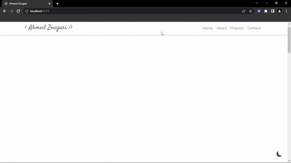

<h1 align="center">Portfolio Template For Developers</h1>

<div align="center">

</div> <br>

<p align="center">
</img>
</img>


</img>
</p>

## Technology Used 🛠️

- [Vite](https://vitejs.dev) - Bundler
- [SASS](https://sass-lang.com) - CSS Preprocessor
- [Bootstrap](https://getbootstrap.com) - CSS Framework
- [Bootstrap-icons](https://icons.getbootstrap.com) - Icons Library
- [PostCSS](https://postcss.org) - CSS Tool
- [Curtains js](https://www.curtainsjs.com) - WebGL JS Library
- [Typed js](https://mattboldt.github.io/typed.js) - JS Library For Typed Effect
- [AOS js](https://michalsnik.github.io/aos) - JS Library For Scroll Animation

## Project Structure 📂

```
├── src
│ ├── fonts
│ ├── img
│ ├── js
│ ├── sass
│ └── index.html
├── .gitignore
├── .postcssrc
├── .GUIDE.md
├── LICENSE
├── package-lock.json
├── package.json
├── README.md
└── vite.config.js
```

## How To Use 🔧

To use this template read the [GUIDE.md](./GUIDE.md) file.

## License 📄

This project is licensed under the MIT License - see the [LICENSE.md](./LICENSE) file for details.

## Sponsor 💛

Give a ⭐ if you like this website!
<br>

<a href="https://www.buymeacoffee.com/zougari"></a>
